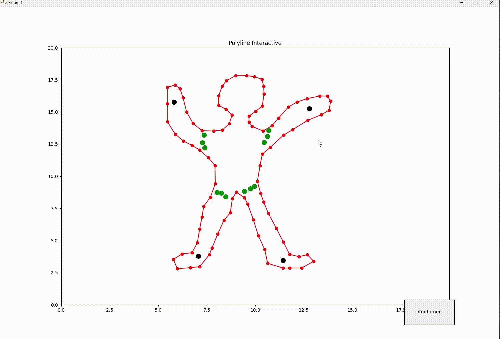

# Surface Modeling Project - 2D Shape Laplacian Editing





## Introduction
This project develops a tool for 2D surface deformation using Laplacian editing techniques. Based on the handle metaphor, the tool enables mesh manipulation through two primary constraints: handles and fixed points. This meshing phase is crucial for applications in 3D modeling, animation, and other fields requiring precise mesh topology control.

## Mesh Creation
After users finalize the placement of handles and fixed points via a confirmation button, a mesh is generated based on these locations. This step is pivotal in transforming defined shapes into functional meshes suitable for various applications.

## Constraint Integration in Mesh Formation
The mesh creation process involves integrating various constraints to guide precise mesh formation. Primary constraints include handles, fixed points, and contour points of the polyline, dictating the mesh's overall topology to adhere to the desired shape and structure.

## Different Types of Triangulations and Constraints

### Delaunay Triangulation
Delaunay Triangulation is a method that optimizes the minimum angle of the triangles, avoiding narrow triangles by considering only the circumcircle criterion. This method is particularly advantageous for creating evenly distributed and visually appealing meshes.

### Constraints
#### Area Constraint
This constraint specifies a maximum area for each triangle, ensuring that the mesh does not contain excessively large triangles, which can be critical for simulation precision and visual aesthetics.

#### Angle Constraint
The angle constraint prevents overly sharp or shallow angles in triangles, promoting more uniform stress distributions in physical simulations and improving the aesthetic of the mesh.

#### Uniformity Constraint
Aims to achieve a uniform distribution of triangle sizes and shapes across the mesh, which can be important for rendering and physical simulation purposes.

## Laplacian Method for Surface Deformation
The Laplacian method for surface deformation is an advanced technique in geometric modeling that uses the Laplacian operator to capture and manipulate local surface properties.

### Laplacian Coordinates
For each vertex $v_i$, the Laplacian coordinate is computed as the difference between the vertex position and the centroid of its neighbors:
```math
\delta_i = v_i - \frac{1}{d_i} \sum_{j \in N_i} v_j
```
where $d_i$ represents the degree of vertex $i$ (number of direct neighbors), and $N_i$ is the set of indices of its neighbors. This representation helps preserve local shape details during global transformations.

### Laplacian Matrix
The Laplacian matrix $L$ of the mesh is defined by:

```math
L = D - A
```
where `D` is the diagonal degree matrix, with $D_{ii} = d_i$, and `A` is the adjacency matrix, with $A_{ij} = 1$ if vertices $i$ and $j$ are connected, and $A_{ij} = 0$ otherwise. The Laplacian matrix encodes the local structure of the mesh, aiding in shape preservation during deformation.

### Deformation with Constraints
Surface deformation, maintaining Laplacian coordinates and fixed constraints, is achieved by minimizing an error functional, defined to measure the deviation between original and deformed Laplacian coordinates while respecting position constraints:
```math
E(V') = \sum_{i=1}^{n} \| \delta'_i - L(v'_i) \|^2 + \sum_{i=m}^{n} \| v'_i - u_i \|^2
```
where $V'$ represents the new vertex positions, $δ'_i$ the new Laplacian coordinates, and $u_i$ the constrained positions (fixed and handles).

### System Resolution
Minimizing $E(V')$ leads to a system of linear equations, typically solved using least squares methods in Numpy. This process allows for controlled, smooth deformation of the surface, ideal for interactive applications in geometric modeling. Below is an example of a deformation performed on our figure.
